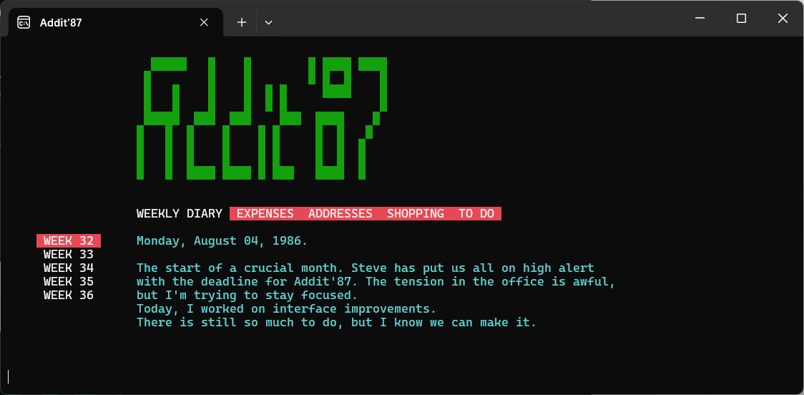

# Addit'87 - Personal Organizer Simulation

Addit'87 is a retro-themed personal organizer simulation inspired by the game "Lake." This project simulates a vintage digital planner with weekly diaries, expenses, addresses, shopping lists, and to-do items.

## Features (view-only)
 - Weekly Diary: Track your daily activities and reflections.
 - Expenses: Log your monthly expenditures.
 - Addresses: Keep a record of important contacts.
 - Shopping & To-Do Lists: Organize your tasks and shopping needs.

# Getting Started

- Download the zip and extract the files and run [[Addit87.exe](https://github.com/mvanetten/AddIt87/archive/refs/heads/main.zip)] (works only on Windows 10 and 11)

# How to use 
- Use the Up/Down arrow key to scroll down the list.
- Use the Left/Right arrow key to scroll down the menu.
- Press Escape to close (Or click the crossmark).

# Customize
You can create your own Addit'87 database by customizing the _main menu_, _submenu_ and _content_.

- Open data.json, modify Menu and Label values under Items. Use a text editor with JSON and UTF-8 support.

In the JSON structure:
- Menu : Defines the title of each main menu 
- Label: Defines the title of each submenu (max 10 items per Menu).
- Text : Contains the content of the submenu, which is an array of strings (max 10 lines).
